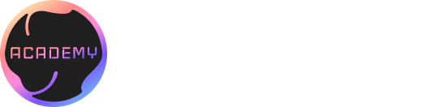

# CosmWasm Smart Contracts

I am excited to add to my portfolio that I have successfully completed the "CosmWasm Smart Contracts Basics" course offered by the CosmWasm Academy. This course was designed to introduce participants to the basics of creating smart contracts using the CosmWasm framework.

# What I Learned
Throughout the course, I learned about the essential components of CosmWasm, including the Cosmos SDK, Rust programming language, and WebAssembly (WASM). I also gained an understanding of the fundamentals of blockchain technology and the importance of smart contracts in the ecosystem.

# The Challenges

One of the challenges I encountered during the course was learning Rust programming language. As someone who was unfamiliar with the language, it was initially challenging to grasp the syntax and concepts. However, with the help of the course's comprehensive material and instructors, I was able to overcome this challenge.

# Conclusion

I am pleased to say that I completed the course successfully and feel confident in my ability to create basic smart contracts using CosmWasm. Although I was not able to take the certification exam due to the cohort being over, I am still proud of my accomplishment.

Overall, I am grateful for the opportunity to have taken this course, and I believe it will serve as a valuable addition to my skillset as a developer.
