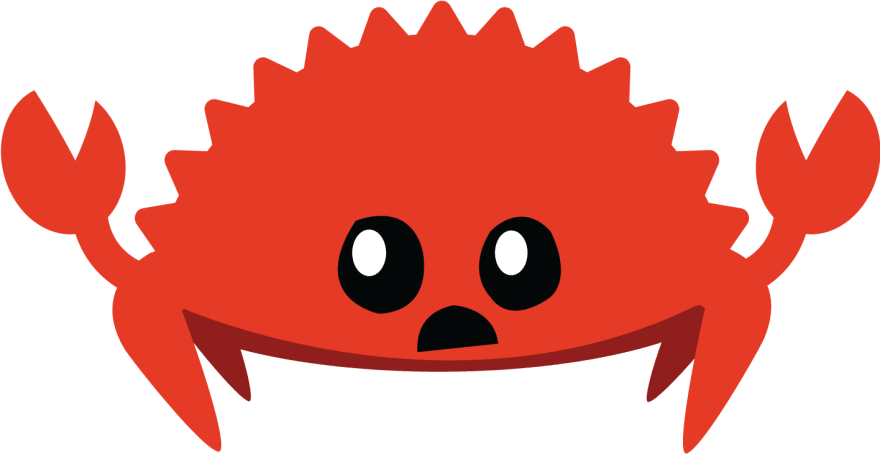
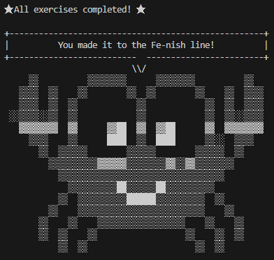

# Completed the "Rustlings" Course

> [The Rustlings GitHub Repository](https://github.com/rust-lang/rustlings)

## Introduction
I recently completed the **Rustlings** course, which is an excellent resource for learning Rust programming language fundamentals. In this course, I was able to acquire essential Rust skills and concepts that I can apply to real-world programming projects.

## Course Details
The **Rustlings** course was a comprehensive program designed to help beginners learn Rust programming. It covers various topics, including ownership and borrowing, control flow, and advanced data types. The course content was delivered through a combination of interactive lessons, quizzes, and practical exercises. The course exercises were designed to enable me to practice the newly learned concepts, test my understanding of Rust, and improve my programming skills.

## Course Challenges
Like any programming language, Rust has its learning curve. While taking the course, I found some topics challenging, especially memory management, ownership, and borrowing. However, the course's well-structured content and clear instructions helped me overcome these challenges and learn effectively. The practical exercises and quizzes provided me with opportunities to apply my newly acquired knowledge and build my confidence.

## My Success
Throughout the course, I gained a comprehensive understanding of Rust programming, and I am proud to say that I successfully completed the course. The exercises were engaging and practical, and they allowed me to develop my coding skills. By the end of the course, I had developed a deep understanding of Rust concepts and how they are used in real-world programming projects.

## Certification Exam
Unfortunately, **Rustlings** did not offer a certification exam, but the knowledge and skills that I

